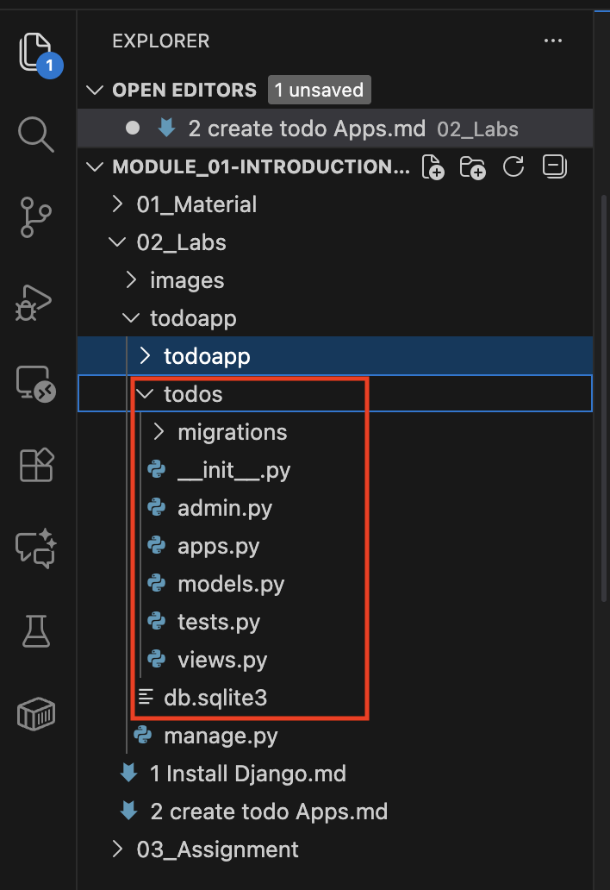
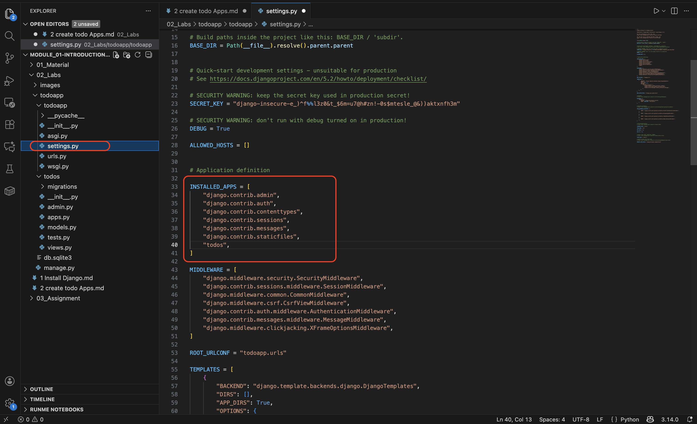
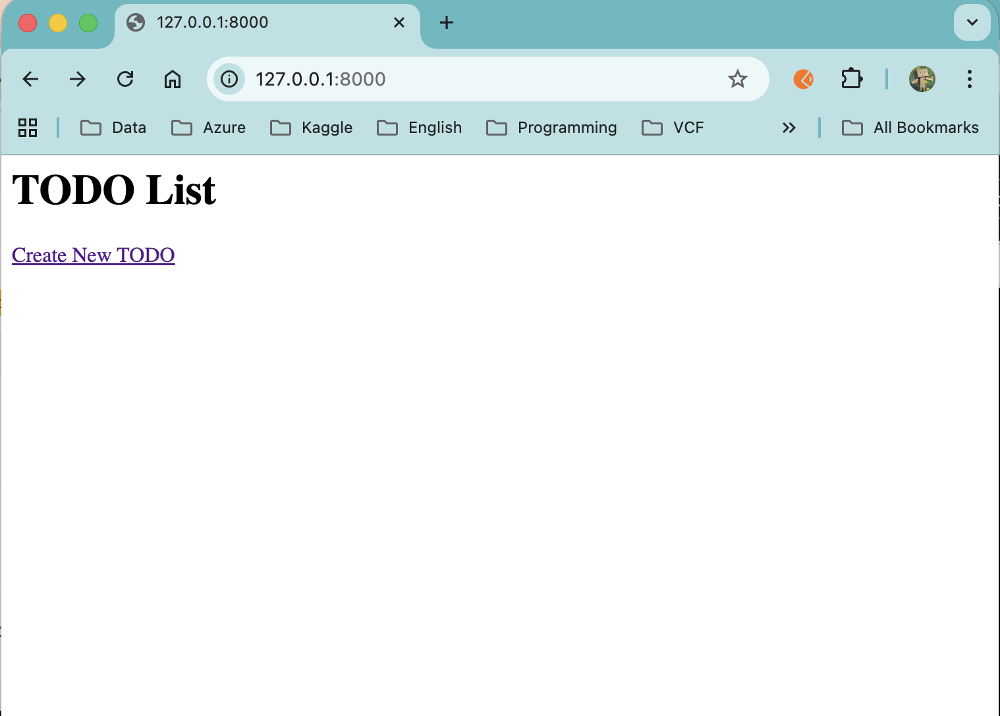
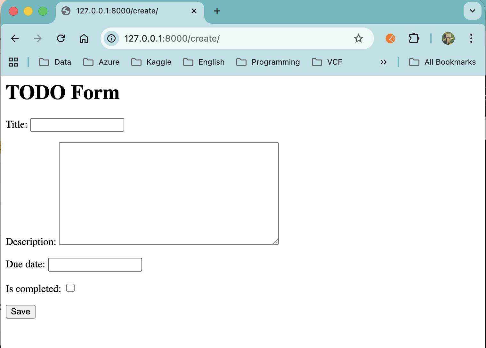

## Create TODO Application

### Step 1: Create TODO Apps
Inside the project folder (same level as manage.py), run:
```bash
python manage.py startapp todos
```

this will create: <br>


### Step 2: Register the App (todos) in the settings.py


<br><br>

### Step 3: Create the Todo Model
Add the following script to todos/models.py

```sh
from django.db import models

class Todo(models.Model):
    title = models.CharField(max_length=200)
    description = models.TextField(blank=True)
    due_date = models.DateField(null=True, blank=True)
    is_completed = models.BooleanField(default=False)
    created_at = models.DateTimeField(auto_now_add=True)

    def _str_(self):
        return self.title
```

### Step 4: Make Migrations

```bash
python manage.py makemigrations
python manage.py migrate
```

### Step 5: Create the Form
create the file named forms.py in todos folder
then add:

```sh
from django import forms
from .models import Todo

class TodoForm(forms.ModelForm):
    class Meta:
        model = Todo
        fields = ['title', 'description', 'due_date', 'is_completed']
```

### Step 6: Create the Views
Edit views.py in todos folder
then replace with:

```sh
from django.shortcuts import render, redirect, get_object_or_404
from .models import Todo
import datetime
from .forms import TodoForm

def todo_list(request):
    todos = Todo.objects.all().order_by('is_completed', 'due_date')
    return render(request, 'todos/todo_list.html', {'todos': todos})

def todo_create(request):
    form = TodoForm(request.POST or None)
    if form.is_valid():
        form.save()
        return redirect('todo_list')
    return render(request, 'todos/todo_form.html', {'form': form})

def todo_edit(request, pk):
    todo = get_object_or_404(Todo, pk=pk)
    form = TodoForm(request.POST or None, instance=todo)
    if form.is_valid():
        form.save()
        return redirect('todo_list')
    return render(request, 'todos/todo_form.html', {'form': form})

def todo_delete(request, pk):
    todo = get_object_or_404(Todo, pk=pk)
    todo.delete()
    return redirect('todo_list')
```

### Step 7: Create URLs for the App
create the file named urls.py in todos folder
then add:

```sh
from django.urls import path
from . import views

urlpatterns = [
    path('', views.todo_list, name='todo_list'),
    path('create/', views.todo_create, name='todo_create'),
    path('edit/<int:pk>/', views.todo_edit, name='todo_edit'),
    path('delete/<int:pk>/', views.todo_delete, name='todo_delete'),
]
```

### Step 8: Connect Apps URL to Main Project
open todoapp/urls.py
modify to include todos.urls:

```sh
from django.contrib import admin
from django.urls import path, include

urlpatterns = [
    path('admin/', admin.site.urls),
    path('', include('todos.urls')),
]
```

### Step 9: Create Templates
Create folder todos/templates/todos/

```sh {"name":"todo_list.html"}
<h1>TODO List</h1>
<a href="">Create New TODO</a>

<ul>
    
        <li>
            <strong>{{ todo.title }}</strong>
             ✔
            <br>
            Due: {{ todo.due_date|default:"No due date" }}
            <br>

            <a href="">Edit</a> |
            <a href="">Delete</a>
        </li>
    
</ul>
```

```sh {"name":"todo_form.html"}
<h1>TODO Form</h1>

<form method="POST">
    
    {{ form.as_p }}
    <button type="submit">Save</button>
</form>
```

### Step 10: Run the Server
```bash
python manage.py runserver
```

then open browser:
http://127.0.0.1:8000/

 <p>

