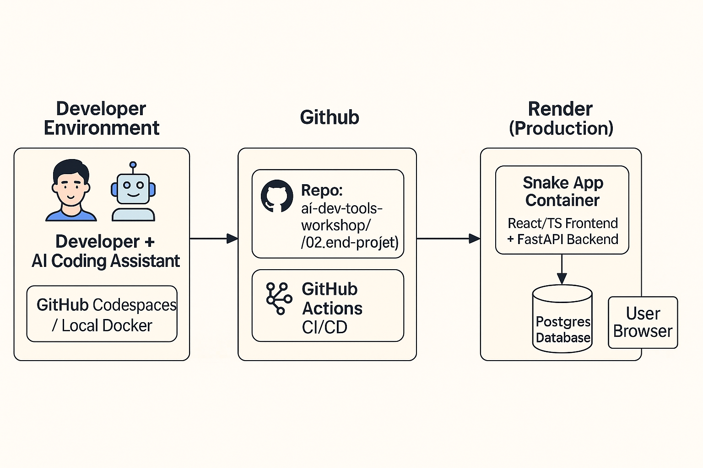

# Module 02 – End to End Project (Snake Game)

- Create Frontend Application using Lovable
- Create First Project
- Create TODO Application

---

## 📚 Topics Covered

Here is End-to-End Development Flowchart.  

   

---

## 📝 Homework

Homework for Module 2 is located here:

👉 [Snake Game](https://github.com/rfnaufal/snake-spectacle)

---

## 🗒️ Notes

Personal notes for this module:

👉 [1 Create Frontend using Lovable](notes/1-Frontend-Apps.md) 
👉 [2 Create Backend](notes/2-backend.md) 
👉 [3 Ingterate Frontend and Backend](notes/3-Integrate.md)
 
