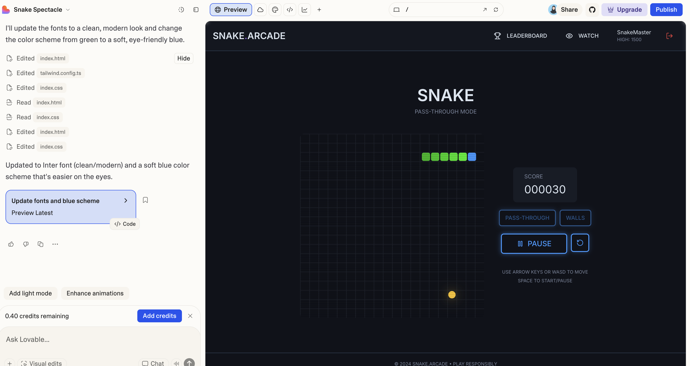

## Create Snake Gmae

### 1. Create frontend application using Lovable

Prompt:
> create the snake game with two models: pass-through and walls. prepare to make it multiplayers - we will have this functionality: leaderboard and watching (me following other players that currently play). add mockups for that and also for log in. everything should be interactive - I can log in, sign up, see my username when I'm logged in, see leaderboard, see other people play (in this case just implement some playing logic yourself as if somebody is playing) make sure that all the logic is covered with tests
>
> don't implement backend, so everything is mocked. But centralize all the calls to the backend in one place

I also added from the original result with prompt:
> Update the fonts to a clean, modern look and change the color scheme from green to a soft, eye-friendly blue.

 <br><br>

the next thing is we need to connect lovable with github and then from the repository created set visibility to public. 


##### 🚀 Built With

<p align="left">
  
  
  
  
  
</p>

### 2. Connect to codespace

#### 2.1 Preparation

As preparation we need to install the following tools:
1. Google Antigravity 
2. Github CLI

```sh
gh auth login
```

There will some questions such as below: <br>
Where do you use GitHub? GitHub.com <br>
? What is your preferred protocol for Git operations on this host? SSH <br>
? Generate a new SSH key to add to your GitHub account? Yes <br>
? Enter a passphrase for your new SSH key (Optional): ************ <br>
? Title for your SSH key: GitHub CLI <br>
? How would you like to authenticate GitHub CLI? Login with a web browser <br>
<br>
then will show code that we need to input in the browser to authorize device. <br>

To create codespace we need admin right in the repository, run:

```sh
gh auth refresh -h github.com -s codespace
```

follow the procedure to grant the permission.

#### 2.2 Create Codespace

```sh
gh cs create
```

enter the repository: {accountname/repo-name} <br>
Machine Type: 2 cores, 8 GB RAM, 32 GB Storage <br>
keep the name for example: bug-free-halibut-7x75wp4j75xfxgvg <br>

Run the command to ssh to the machine:

```sh
gh cs ssh -c bug-free-halibut-7x75wp4j75xfxgvg
```

#### 2.3 Connect Codespace to Antigravity

we need to setup ssh so we can ssh easier to connect to codespace. 

```sh
gh cs ssh --config -c bug-free-halibut-7x75wp4j75xfxgvg
```

it will generate like this:
Host cs.bug-free-halibut-7x75wp4j75xfxgvg.main
	User codespace
	ProxyCommand /opt/homebrew/bin/gh cs ssh -c bug-free-halibut-7x75wp4j75xfxgvg --stdio -- -i /Users/rfnaufal/.ssh/codespaces.auto
	UserKnownHostsFile=/dev/null
	StrictHostKeyChecking no
	LogLevel quiet
	ControlMaster auto
	IdentityFile /Users/rfnaufal/.ssh/codespaces.auto

then added the lines into ~/.ssh/config
