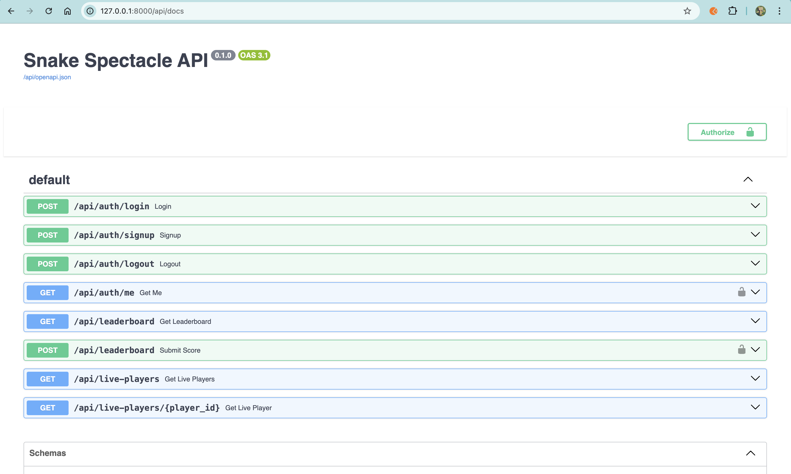
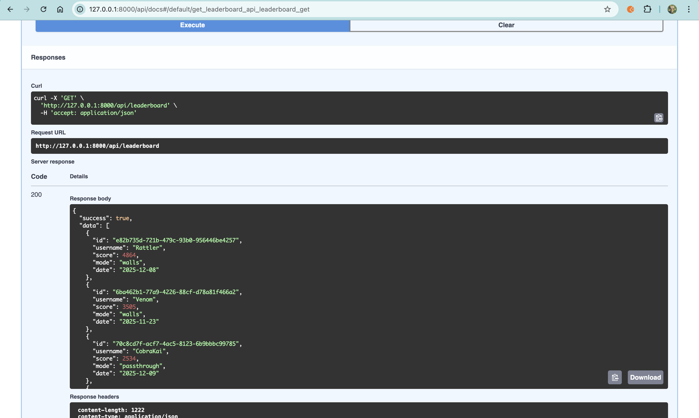

## Create Backend for Snake Game Application

### 1. Create OpenAPI Spec

Prompt:

>analyse the content of the client (frontend folder) and create an openAPI specs based on what it needs. <br>
>later we want to implement backend based on these specs


In my case, it didn’t create the file inside the workspace; instead, it generated the file here:<br>
/home/codespace/.gemini/antigravity/brain/ccf404e9-0e28-4e31-9811-ded869114393/openapi.yaml<br>
then copy the content and save it under workspaces named openapi.yaml.

```sh
# install uv 
pip install uv

#initialize project
uv init
```

### 2. Implement Backend

2.1 Create AGENTS.md

Add the content:

```
For backend development, use `uv` for dependency management.

Useful Commands

    # Sync dependencies from lockfile
    uv sync

    # Add a new package
    uv add <PACKAGE-NAME>

    # Run Python files
    uv run python <PYTHON-FILE>
    
    regularly commit code to github
```

Prompt:
>based on the OpenAPI specs, create fastapi backend for now use a mock database, which we will later replace with a real one create tests to make >sure the implementation works
>
>follow the guidelines in AGENTS.md

the agents will create necessary files. You might find the errors, let the agent fix it. <br>
by run @terminal:bash and select the bash if you have multiple bash process. <br>

```sh
# run it under backend folder
uv run pytest
```

```sh
# running the server
uv run uvicorn main:app --reload

#It will run at http://127.0.0.1:8000
# to stop
pkill -f "uvicorn main:app"
```

```sh
#now run your verification script:
uv run python verify_api.py 
```

go to browser, you can access from Port tab and click globe icon and type: http://127.0.0.1:8000/api/docs <br>
the Result will be like this: <br><br>


additional prompt required for my case such as:
> I dont see authorize button in the api docs, please make correction

> update information to the readme in the backend folder about how to run the server and to access api documentation

> add fake data so i can test the api docs<br>
<br>
Here is sample rest call:<br><br>
<br>
<br>
🚀 Built With (Backend)
<p align="left">
  
  
  
  
  
  
  
</p>