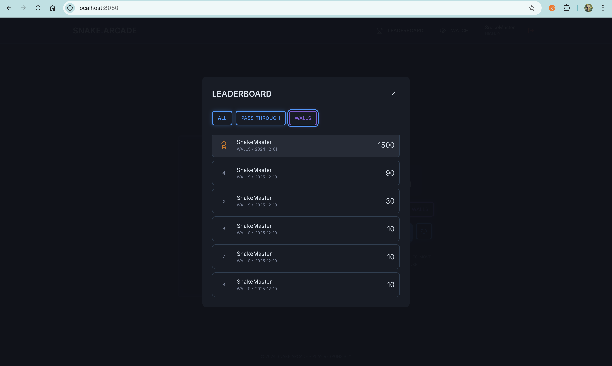
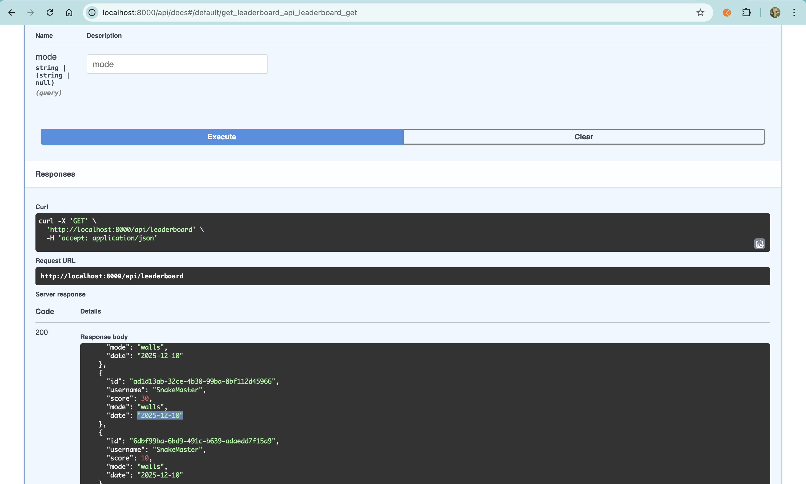

## 3. Integrating Frontend and backend

Prompt:

> make frontend use backend. use openapispec for guidance and follow the guideline in AGENTS.md

<br>
Connected frontend to backend by configuring Vite proxy to forward /api requests to localhost:8000 and refactoring api.ts. 
<br>

Prompt:

> create a makefile for running backend

**Content of Makefile:**

```sh
.PHONY: install-backend run-backend

install-backend:
	cd backend && uv sync

run-backend:
	cd backend && uv run uvicorn main:app --reload --port 8000
```

**Explanation:** <br>
A Makefile is a special file used by the make build automation tool. In this project, I created it to act as a task runner or shortcut manager.<br>

Instead of typing long, complex commands or manually changing directories, you can just run simple make commands.<br>
Here is what the specific commands in your Makefile do: <br>

make install-backend: <br>
What it does: Runs cd backend && uv sync <br>
Why use it: Installs or updates all the Python dependencies for your backend without you needing to cd into the folder first. <br>
make run-backend: <br>
What it does: Runs cd backend && uv run uvicorn main:app --reload --port 8000 <br>
Why use it: Starts your backend server with one short command. <br>
It handles the directory switching and specific flags (like --reload for development) automatically.<br>
It's essentially a way to save you time and keystrokes! <br>

Since the result still not as expcted then i added prompt:<br>
I expected in the package.json they command will use the makefile that we created.  <br>

> for test backend can we use make test? <br>

Prompt:<br>

> then i also find that when access backend http://127.0.0.1:8000/ it's show {"detail":"Not Found"}<br>
> I want to have mesage such as welcome to backend snake game<br>

Prompt: <br>

> I want to add node_modules to gitignore, so ensure you add install:all to install required package the package.json

So here is the result: <br><br>
 <br><br>
 <br><br>


To run the application on localhost 8080 (frontend) and its backend, follow these steps. Note that the folder is named snake-spectacle (not snake-pinacle).
<br>
Navigate to the project directory:
> cd /workspaces/snake-spectacle

Install dependencies (if you haven't already): <br>
> npm run install:all 

Start the development server: <br>

> npm run dev <br>

This single command will start both:

Frontend: http://localhost:8080 (configured in frontend/vite.config.ts)
Backend: http://localhost:8000 (managed by make run-backend)
The frontend is configured to proxy /api requests to the backend, so everything should work seamlessly on port 8080.