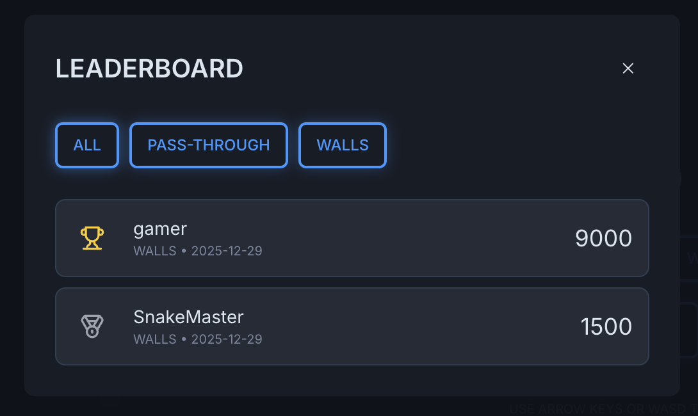
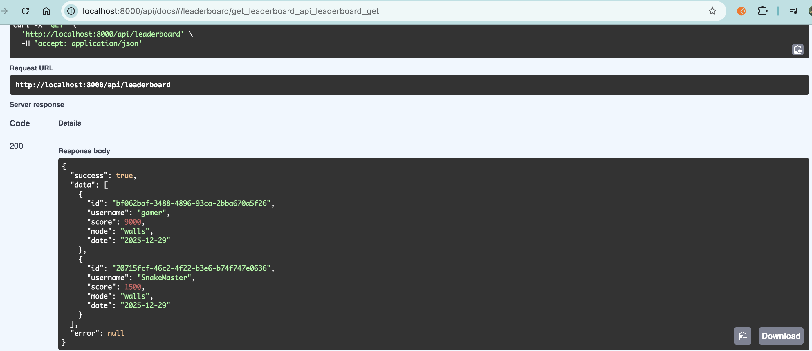

## 4. Add Database for Backend

prompt: 
> for backend we use postgres and sqllite database using sqlalchemy

When the backend server starts and initializes the database (defaulting to 
sql_app.db
 for SQLite), the following specific changes occur:

1. File System:  
- A new file named sql_app.db
 is created in the backend/ directory (if using SQLite).
2. Database Schema (Tables Create):
- users: Table for storing user credentials and high scores.
    - Columns: id, username, email, password, highScore, createdAt.
- leaderboard: Table for storing game scores.
    - Columns: id, username, score, mode, date.

### Validation Steps

To validate the DB implementation, I ran the game locally using the following command:
>npm run dev

After playing the game, a score was recorded:

  
To verify data persistence, I stopped the server using Ctrl + C, then restarted it with:
> npm run dev

After restarting, the previously recorded score was still present, confirming that the data was successfully persisted:

 