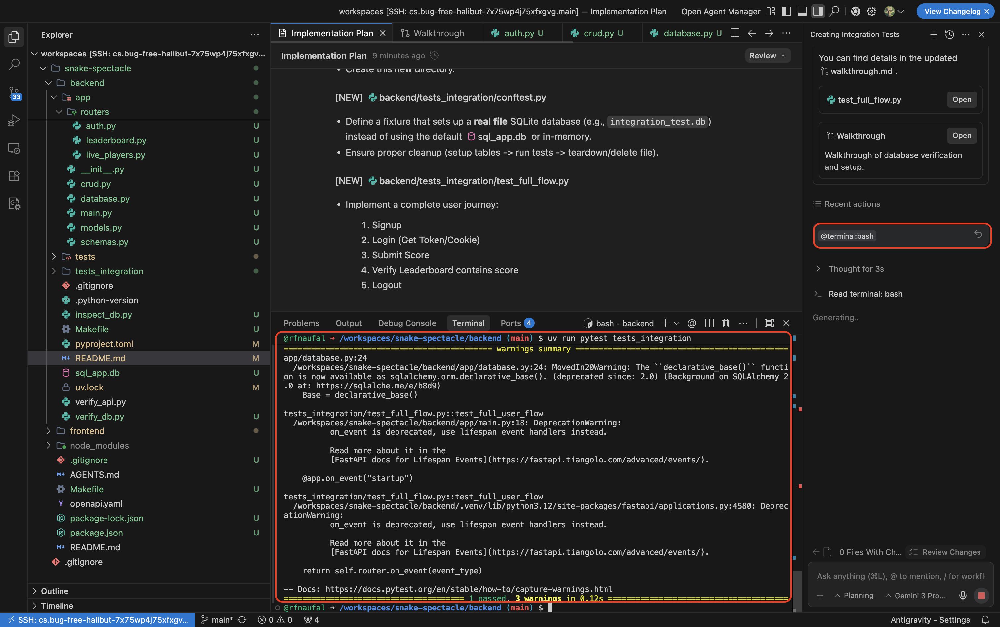
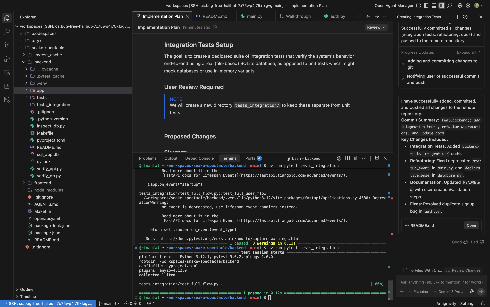

## 5. Integration Test
Prompt:
>create integration test using sqllite to make thing work. put the integration test in a spearate folder test_integration

To validate the integration tests, run:

>uv run pytest tests_integration

Result:  
For the first integration test run, the following warning was displayed:

  

After observing the warning, I proceeded to run the following command in the chat using @terminal:bash.

Changes:

FastAPI Lifecycle
- Replaced the deprecated `@app.on_event("startup")` with the modern `lifespan` async context manager in `app/main.py`.
- This is the recommended approach for handling startup and shutdown logic in newer FastAPI versions.

SQLAlchemy
- Updated `app/database.py` to use the correct `declarative_base` import from `sqlalchemy.orm`.

Verification
- Ran `uv run pytest tests_integration`, which now passes successfully without the previous deprecation warnings.
- Fixed a minor issue in the integration tests where models were not initializing correctly with the updated setup.

The codebase is now cleaner, more maintainable, and future-proofed against upcoming library updates.

and now it passed. 
  

I also prompt to push to git and update the .gitignore files for unnecesary file and better security (remove sensitive files)