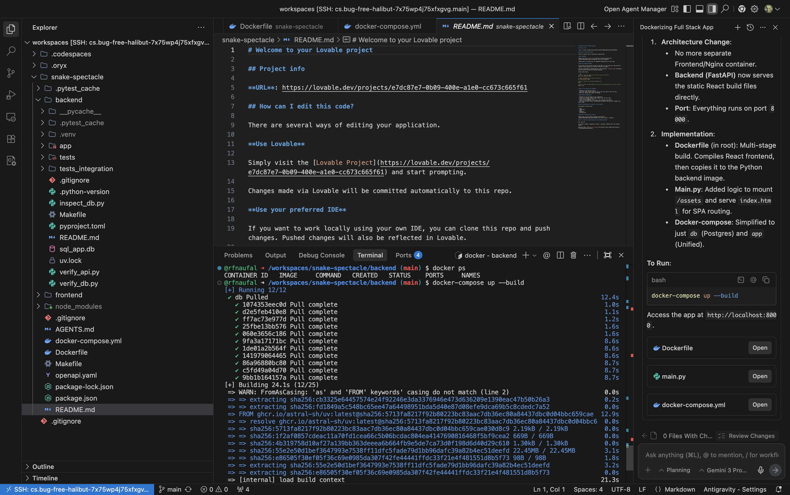

## 6. Containerized The Application
Prompt:
>we have frontend and backend sqllite. put everything into docker compose and use postgres there. we can serve frontend with nginx or whatever you recommend. 
make sure to follow guideline in AGENT.md

Components Created:  

1. Frontend: frontend/Dockerfile (Multi-stage: Node build -> Nginx serve) and frontend/nginx.conf.
2. Backend: backend/Dockerfile using Python 3.12 and uv.
Orchestration: docker-compose.yml spinning up:
db: PostgreSQL (Official Alpine image)
backend: Connected to PgSQL via DATABASE_URL
frontend: Served on port 80, proxying /api requests to the backend.
How to Run:

bash
docker-compose up --build
This will start the full stack. You can access the app at http://localhost.

Prompt:
> Put both backend and frontend in one container.

It's successfully consolidated the application into a Single Container.

1. Architecture Change:
- No more separate Frontend/Nginx container.
- Backend (FastAPI) now serves the static React build files directly.
= Port: Everything runs on port 8000.
2. Implementation:
- Dockerfile (in root): Multi-stage build. Compiles React frontend, then copies it to the Python backend image.
- Main.py: Added logic to mount /assets and serve index.html for SPA routing.
- Docker-compose: Simplified to just db (Postgres) and app (Unified).

To Run:
> docker-compose up --build

Access the app at http://localhost:8080

  